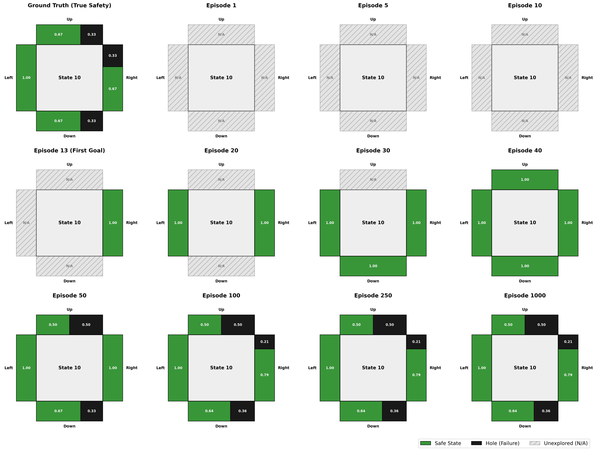
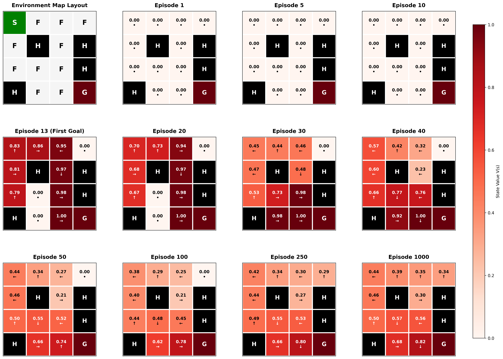
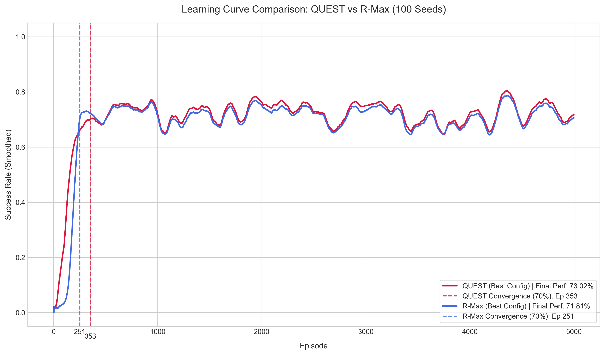
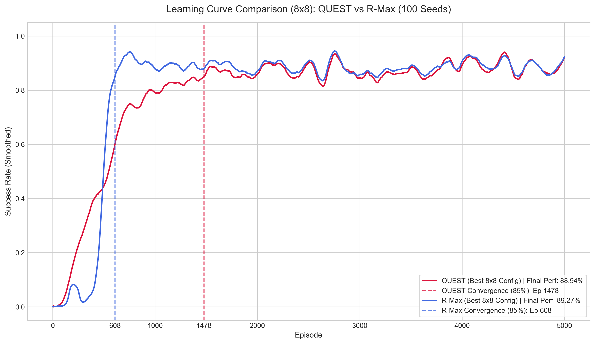
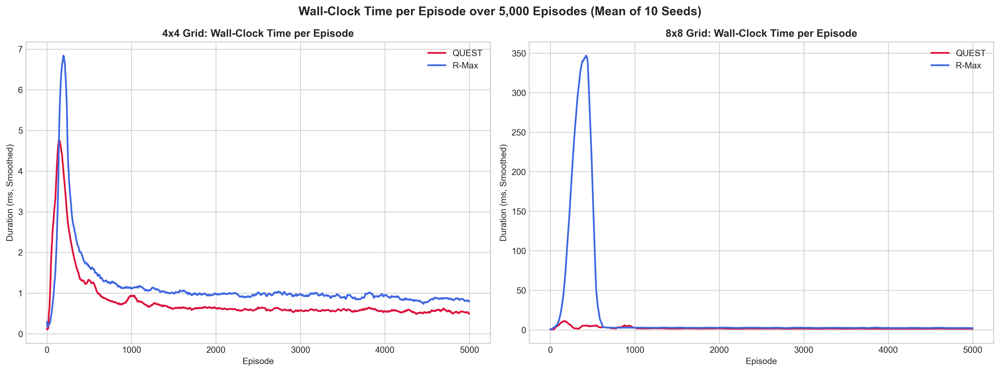
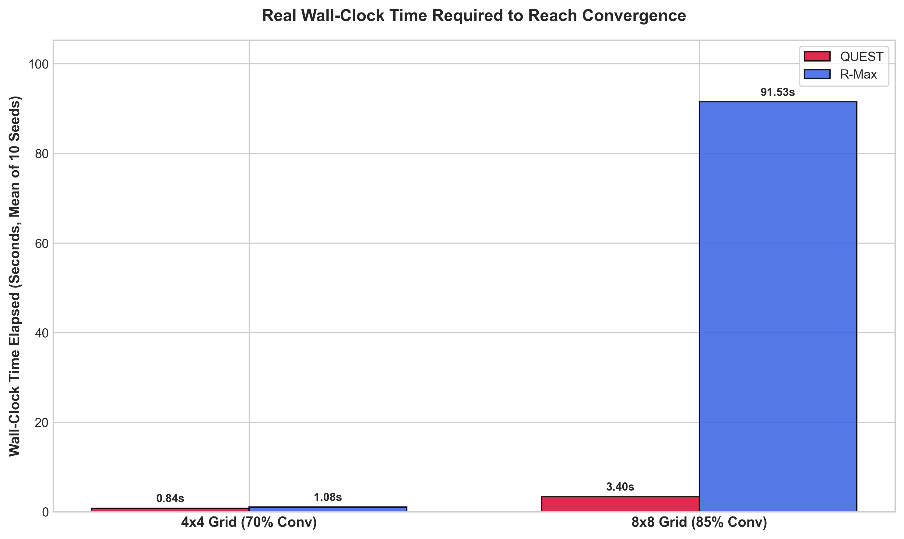

# QUEST Research Paper Summary & Results

This document serves as an interactive companion guide to the paper:
> **Q-learning via UCB Exploration and Systematic Terminal-sweeps (QUEST): A Decoupled Architecture for Model-Based Reinforcement Learning**  
> *Author: Manuel Wirth (University of Mannheim)*  


---

## 1. Executive Summary

QUEST (Q-learning via UCB Exploration and Systematic Terminal-sweeps) is a standalone **Model-Based Reinforcement Learning** architecture designed for highly stochastic, sparse-reward Markov Decision Processes (MDPs). It solves the exploration-exploitation dilemma by **decoupling value estimation from exploration incentives**:

1. **Empirical MDP Modeling**: Constructs a Maximum Likelihood transition model $\hat{P}$ and reward model $\hat{R}$ from interaction history.
2. **Decoupled Localized Exploration**: Restricts optimism strictly to the online action selection phase via a count-based Upper Confidence Bound (UCB). The offline Q-table remains an objective representation of the empirical model.
3. **Systematic Terminal-Sweeps**: Disables online Temporal Difference (TD) updates. Instead, at the end of each episode, it performs an intensive offline Value Iteration sweep to propagate sparse rewards across the entire known state space.

---

## 2. Core Architectural Components

### A. Local UCB Action Selection
Unlike classic deep exploration methods that inject optimistic bonuses directly into the Bellman equations (creating systematic overestimation bias), QUEST applies UCB strictly during action selection:

$$ UCB(s, a) = Q(s, a) + c \times \sqrt{\frac{\ln N(s)}{N(s, a)}} $$

* Prioritizes unvisited actions ($N(s, a) = 0$) absolutely.
* Balances objective exploitation $Q(s, a)$ with exploration curiosity dynamically scaled by $c$.

### B. Systematic Terminal Sweeps
Upon episode termination, QUEST sweeps the empirical model using Value Iteration for $I = 5 \times |\mathcal{S}|$ iterations:

$$ Q(s, a) \leftarrow \sum_{s'} \hat{P}(s' \mid s, a) \left[ \hat{R}(s, a, s') + \gamma \max_{a'} Q(s', a') \right] $$

This offline "experience replay" propagates sparse rewards backward through all known stochastic branches instantly.

---

## 3. Internal Learning Dynamics (Case Study: Seed 43)

### A. State-Space Coverage
In early episodes, the agent prioritizes unvisited actions. As soon as all actions are tried, count-based UCB takes over, directing the agent to safely navigate the stochastic layout.


### B. Resolving Stochastic Deception
At State 10 (adjacent to a hole at State 11), early stochastic slips can lead to "lucky survivals" that temporarily skew transition probabilities. Over time, UCB samples all actions, correcting empirical safety values.



### C. State Value Function Propagation
Value iteration initially overestimates state values due to optimistic early transition models. As more steps are collected, sweeps mathematically shrink this overestimation bias down to the exact stochastic limits.



---

## 4. Large-Scale Empirical Results (100-Seed Validation)

The optimal configurations found by Optuna were evaluated against exact Tabular R-MAX across a massive ensemble of **100 independent seeds**. Both algorithms converge to identical asymptotic performance limits.

### A. 4x4 Environment (Threshold $\ge 70\%$)
* **QUEST (Best Config)**: Exploration $c = 0.0907$, Discount $\gamma = 0.9917$. Converges in **353 episodes** to **73.02%** success rate.
* **R-Max (Best Config)**: Threshold $m = 14$, Discount $\gamma = 0.9850$. Converges in **251 episodes** to **71.81%** success rate.



### B. 8x8 Environment (Threshold $\ge 85\%$)
* **QUEST (Best 8x8 Config)**: Exploration $c = 0.0138$, Discount $\gamma = 0.9988$. Converges in **1,478 episodes** to **88.94%** success rate.
* **R-Max (Best 8x8 Config)**: Threshold $m = 8$, Discount $\gamma = 0.9990$. Converges in **608 episodes** to **89.27%** success rate.



---

## 5. Computational Complexity and the $27\times$ Speedup

While R-Max exhibits slightly higher sample efficiency (fewer training episodes), **QUEST achieves a $\approx 27\times$ wall-clock speedup** on the complex $8\times8$ grid:
* **QUEST Convergence Time**: **3.40 seconds**
* **R-Max Convergence Time**: **91.53 seconds**

### Why is R-Max so much slower?
1. **Unoptimized Update Frequency**: Tabular R-Max runs Value Iteration at the end of *every single episode* ($5,000$ times). Since the model only changes when a state-action transitions to "known", Value Iteration is theoretically only needed at most $256$ times.
2. **The $V_{\max}$ Optimism Bottleneck**: R-Max initializes unknown states to $V_{\max} \approx 986.1$. During early exploration, propagating these massive values through the state space forces Value Iteration to run for an average of **65+ iterations per episode** to reach convergence.
3. **QUEST's Zero-Q Initialization**: QUEST initializes the Q-table to $0$. Before the goal is reached, all Q-values are $0$, letting Value Iteration terminate in exactly **1.0 iteration** (taking $< 0.1$ ms). Once the goal is found, QUEST warm-starts and converges in $< 5$ iterations, avoiding $V_{\max}$ propagation completely.




---

## 6. How to Reproduce
1. **Sync dependencies**:
   ```bash
   uv sync
   ```
2. **Regenerate sweeps**:
   ```bash
   # Run the 100-seed validation sweeps
   uv run python run_4x4_100seeds_sweep.py
   uv run python run_4x4_100seeds_sweep_rmax.py
   uv run python run_8x8_100seeds_sweep.py
   uv run python run_8x8_100seeds_sweep_rmax.py
   ```
3. **Run Speed Benchmark**:
   ```bash
   uv run python run_speed_benchmarks.py
   ```
4. **Re-plot comparison learning curves**:
   ```bash
   uv run python plot_comparison_shaded.py
   ```
5. **View Optuna HPO Dashboard**:
   ```bash
   # QUEST 4x4 Grid
   uvx optuna-dashboard QUEST_Multi_Objective_4x4.log

   # QUEST 8x8 Grid
   uvx optuna-dashboard QUEST_Multi_Objective_8x8.log

   # R-Max 4x4 Grid
   uvx optuna-dashboard RMax_Multi_Objective_4x4.log

   # R-Max 8x8 Grid
   uvx optuna-dashboard RMax_Multi_Objective_8x8.log
   ```
