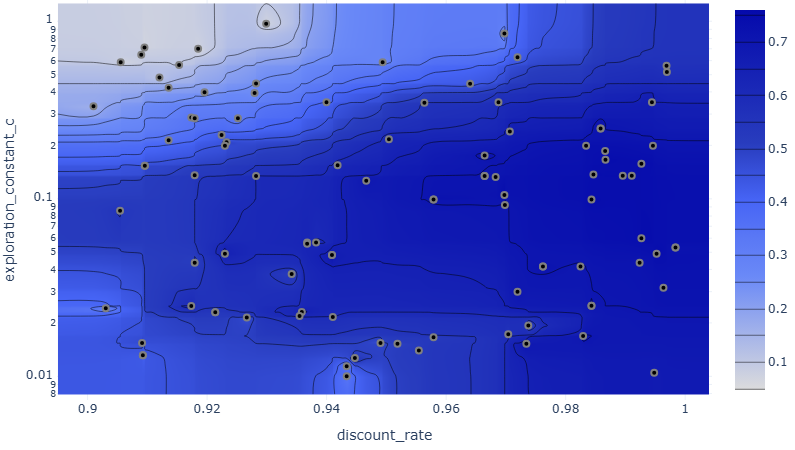
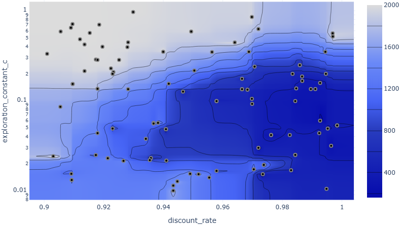
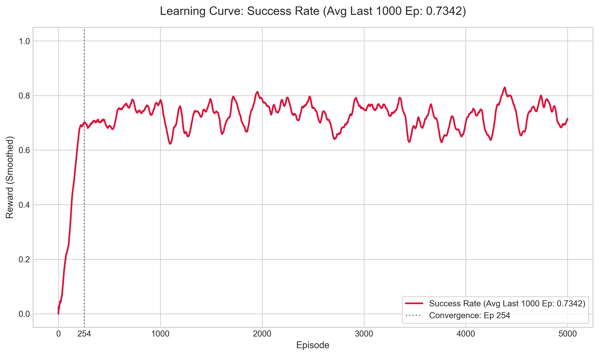
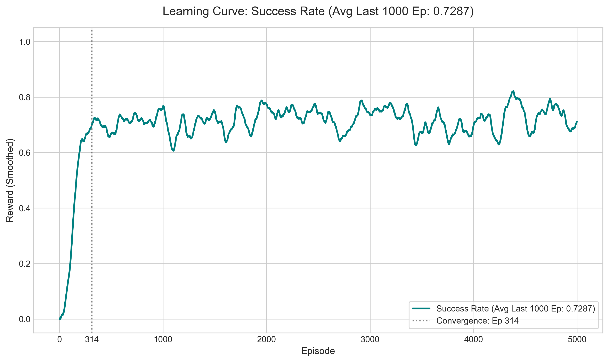

# QUEST Agent on Slippery FrozenLake-v1

**Q**-learning via **U**CB **E**xploration and **S**tochastic **T**erminal-sweeps

---


## 1. The Environment: FrozenLake-v1 (4x4, Slippery)

*   **State Space**: A $4 \times 4$ grid (16 discrete states, index 0 to 15) starting at `(0,0)` and reaching the goal at `(3,3)`.
*   **Action Space**: 4 discrete actions: `0: Left`, `1: Down`, `2: Right`, `3: Up`.
*   **Rewards**: $+1.0$ for reaching the goal state, and $0.0$ otherwise (including falling into a hole).
*   **Stochasticity (`is_slippery=True`)**: If the agent chooses an action, there is only a $\frac{1}{3}$ probability of moving in that direction. There is a $\frac{1}{3}$ chance of slipping to the left and a $\frac{1}{3}$ chance of slipping to the right relative to the intended action. Because of this stochastic behavior, a success rate of 100% is mathematically impossible (the agent can slide into a hole even with an optimal policy). 

---

## 2. The Algorithm

TODO

## 3. Multi-Objective HPO (Optuna)
To run the Optuna dashboard locally:
```bash
uvx optuna-dashboard QUEST_Multi_Objective.log
```

Hyperparameter Optimization (HPO) was performed over 3 Seeds (111, 222, 333) for 100 Trials using **Optuna** to optimize two conflicting objectives:
1.  **Maximize Final Performance**: Mean reward of the last 1,000 episodes.

2.  **Minimize Convergence Speed**: Defined as the first episode where the 100-episode rolling success rate (average reward) crosses **0.70**.



---

## 4. Results (25-Seed Sweep)

Evaluation across 25 independent seeds showed the following robust metrics for the two Pareto champion runs:

| Run Configuration | Exploration constant $c$ | Discount rate $\gamma$ | Convergence Episode (to $\ge 0.70$) | Final Performance (Last 1,000 Ep Avg) |
| :--- | :--- | :--- | :--- | :--- |
| **Trial 74** | $0.0600$ | $0.9927$ | **314** | **0.7287** |
| **Trial 92** | $0.0990$ | $0.9843$ | **254** | **0.7342** |

*   **Trial 92** generalizes exceptionally well, achieving both faster convergence (**254 episodes**) and a higher final average reward (**0.7342**).

*   **Trial 74** converges in **314 episodes** with a final average reward of **0.7287**.


---

## 5. Installation & Dependency Versions

To ensure deterministic environments, dependencies are locked in `uv.lock`.

### Syncing Locked Versions
To create a local virtual environment and install the exact package versions used to generate these results, run:
```bash
uv sync
```
This reads the locked versions from `uv.lock` (including `gymnasium==1.3.0`, `matplotlib==3.10.9`, `optuna==4.8.0`, `pandas==3.0.3`, and `torch==2.12.0`) and configures your virtual environment.

### Running scripts inside the uv environment
*   **Train the default agent**:
    ```bash
    uv run main.py
    ```
*   **Run parallel seed sweeps**:
    ```bash
    uv run seed_sweep.py
    ```
*   **Plot the results**:
    ```bash
    uv run plot.py
    ```
