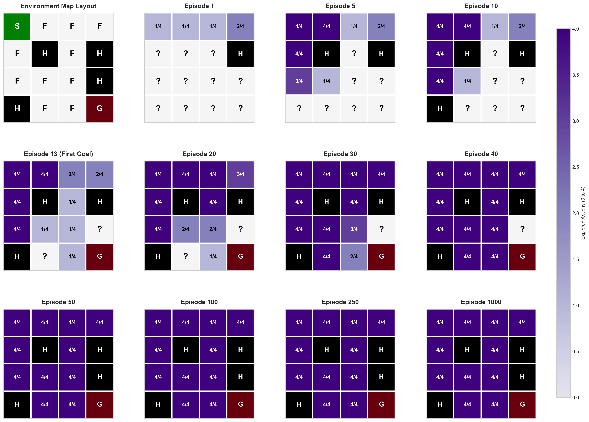

# Research Report: QUEST Agent Training Dynamics (Seed 43)

This report details the model learning, value progression, and decision-making dynamics of the model-based **QUEST** agent on the slippery 4x4 FrozenLake environment using **Seed 43** as a case study. 

---

## 1. Action Consequences at State 10
State 10 (row 2, column 2) is a critical gateway state situated directly to the left of the Hole at State 11, and above the safe gateway State 14. 

### What the Plot Shows
This 3x4 grid represents a spatial D-pad (cross) layout of the safety consequences of taking each of the four cardinal actions (**Left**, **Down**, **Right**, **Up**) at State 10.
* **Forest Green segments** represent transitions to safe states.
* **Black segments** represent transitions to hole states (failure).
* **Light grey hashed segments (N/A)** represent unexplored actions.

### Mathematical Formulation
The safety consequences are computed empirically from the agent's internal transition counts $C(s, a, s')$. The probability of landing in a safe state vs. a hole is:
$$P(\text{Safe} \mid s, a) = \frac{\sum_{s' \notin \text{Holes}} C(s, a, s')}{\sum_{s''} C(s, a, s'')}$$
$$P(\text{Hole} \mid s, a) = \frac{\sum_{s' \in \text{Holes}} C(s, a, s')}{\sum_{s''} C(s, a, s'')}$$
Where $\text{Holes} = \{5, 7, 11, 12\}$.

### Key Visual & Algorithmic Highlights
> [!NOTE]
> **The Slippage Discovery Paradox:**
> At Episode 50, the D-pad for State 10 shows that **Action Right (2)** has been executed 3 times with **100% safety** (no hole transitions). Yet, State 11 is already recognized as a Hole.
> How? The agent discovered the hole at State 11 *not* by going Right, but by going **Down (1)** and **Up (3)** and slipping into it:
> * **Down (1)** slipped right into State 11 **3 times** (out of 9 attempts).
> * **Up (3)** slipped right into State 11 **1 time** (out of 2 attempts).
> * Because the environment is slippery, the agent's attempts to go Right happened to slip vertically to safe states (14 and 6), keeping the Right action consequences falsely "100% safe" while successfully mapping the Hole.
>
> **Chronological Exploration of State 10:**
> * **Episodes 1 to 10:** State 10 has not been discovered yet (marked as `?` in the model coverage plot), so no action has been taken.
> * **Episode 13 (First Goal Reach):** State 10 is reached for the first time. Since there are unvisited actions left, the agent selects Action **Right (2)**. However, due to the stochastic nature of the environment (slippage), the transition actually goes **Down** to State 14, which ultimately leads to the first reach of the goal. Because of this slip, the Right action—which points directly to the Hole at State 11—initially registers a survival probability of **100%**.
> * **Episode 20:** State 10 is reached for the second time. The agent selects Action **Left (0)**, which successfully transitions to State 9 (safe).
> * **Episode 30:** The agent selects Action **Down (1)**, transitioning to State 9 (safe).
> * **Episode 40:** The final unused action, **Up (3)**, is chosen (transitioning to State 9), completing the coverage of all four cardinal actions for State 10.
>
> **Deterministic Tie-Breaking with 100% Safety:**
> When multiple actions have been executed and all show a 100% safety probability (as seen at Episode 40 for Actions Left, Down, and Up):
> 1. **UCT Value Comparison:** The agent compares their UCT values ($Q(s, a) + \text{exploration bonus}$). Actions leading to states closer to the Goal will have higher Q-values (exploitation term) and thus higher UCT values, which are preferred.
> 2. **Deterministic Index-Order Tie-Breaking:** If UCT values are exactly equal (i.e., identical Q-values and identical visit counts $N_{sa}(s,a)$), the agent does **not** pick randomly. Because the action selection relies on NumPy's `np.argmax`, ties are deterministically broken in favor of the action with the lowest index in the order: **Left (0)**, **Down (1)**, **Right (2)**, **Up (3)**. At Episode 40, this is why the policy arrow flips to **Left (←)**.

---

## 2. Evolution of Model Coverage
Model coverage shows how thoroughly the agent has explored the actions in each state as it builds its internal transition model.

### What the Plot Shows
A 3x4 grid tracking how many of the 4 cardinal actions the agent has executed for each state.
* **Cell values** show the ratio of explored actions (e.g., `0/4` to `4/4`), colored in shades of **Purple**.
* **Black cells ("H")** and the **Dark Red cell ("G")** show the Holes and Goal once they have been discovered by the agent.
* **Light grey cells with "?"** represent completely undiscovered states (states the agent has never transitioned to).

### Mathematical Formulation
The model coverage of a state $s$ is the number of actions with positive visit counts in the agent's visit table $N_{sa}(s, a)$:
$$\text{Coverage}(s) = \sum_{a \in \text{Actions}} \mathbb{I}(N_{sa}(s, a) > 0)$$
Where $\mathbb{I}$ is the indicator function.
* An undiscovered state $s'$ is defined by transition arrival counts $K(s') = 0$ (excluding the Start state).
* Holes and the Goal are absorbing states, meaning they have 0 outgoing actions (`0/4`) once reached.

### Key Visual & Algorithmic Highlights
> [!TIP]
> **Curiosity-Driven Path Mapping:**
> * **Episode 1**: The entire map (except the Start state) is marked as `?` because the agent has no transition data for them.
> * **Episode 13 (First Goal Reach)**: The agent has carved a narrow path to the goal, leaving surrounding states completely undiscovered (`?`).
> * **Episode 50 vs. 1000**: In later episodes, the agent achieves full coverage (`4/4`) for safe corridor states like 0, 4, 8, 9, 13, and 14. However, it avoids wasting exploration steps on dead-ends, demonstrating how the QUEST agent's UCT exploration bonus focuses attention where it is most useful.

---

## 3. Evolution of the State Value Function & Policy
The state value function progression plots represent the core learned utility $V(s)$ and the resulting greedy action policy.

### What the Plot Shows
A 3x4 grid representing the state value $V(s) = \max_a Q(s, a)$ as a red heatmap, overlaid with arrows representing the greedy policy.
* **Red intensity** maps to value ($0.0$ to $1.0$).
* **Arrows** show the greedy action direction. A bullet (**•**) represents unvisited states or states with all zero Q-values.

### Mathematical Formulation
Values are computed using offline value iteration over the agent's estimated transition model:
$$Q(s, a) = \sum_{s'} P(s' \mid s, a) \left[ R(s, a, s') + \gamma V(s') \right]$$
$$V(s) = \max_a Q(s, a)$$
Where $\gamma = 0.984$ is the discount rate, and $R(s, a, s')$ is the average reward received during the transition.

### Key Visual & Algorithmic Highlights
> [!IMPORTANT]
> **The Policy Correction Flip (State 10):**
> * **Episode 13 (First Goal Reach)**: The agent has just discovered the goal. Q-values are highly optimistic because the transition model has few samples (making transitions look deterministic). At State 10, the policy arrow points **Right (→)**.
> * **Episode 30**: The policy at State 10 still points **Right (→)** because the agent thinks it is a shortcut to State 14 -> 15.
> * **Episode 40**: Once the agent has explored actions Down and Up and slipped into State 11, the model learns the existence of the Hole at State 11. Offline value iteration propagates this risk backward, dropping the value of going Right.
> * **The Flip**: At Episode 40, State 10's arrow **switches sides** to point **Left (←)**. The agent has corrected its policy to route leftwards (towards State 9 -> 13 -> 14), actively avoiding the newly discovered hole at State 11!

---

## 4. OmniRL Convergence Metrics
To evaluate the convergence speed of the QUEST agent, we analyze its performance across multiple training runs using the **OmniRL Convergence Metrics** framework.

### Methodology
1. **Seeds Swept**: Training is executed over three independent random seeds (`42, 43, 44`) for 1,000 episodes each.
2. **Smoothing Curve**: For each episode $e$, the average success rate is calculated using a sliding window of the last 20 episodes (i.e., $[e-19, e]$) across all 3 seeds (a total of 60 episodes per window).
3. **Peak Performance**: The absolute maximum value of the smoothed curve is identified as the "Peak Success Rate" (or "Best Average Episodic Performance").
4. **99% Convergence Threshold**: The convergence threshold is set at $99\%$ of the Peak Success Rate:
   $$\text{Threshold} = 0.99 \times \text{Peak Success Rate}$$
5. **Convergence Speed**: The convergence speed is defined as the first episode (scanning from Episode 1 forward) that touches or crosses this $99\%$ threshold.

### Results
* **Peak Success Rate**: **86.67%** (52/60 successful runs in the window), achieved at **Episode 932**.
* **99% Convergence Threshold**: **85.80%** (calculated as $86.67\% \times 0.99$).
* **Convergence Speed**: **Episode 932** (the first episode to reach or exceed $85.80\%$).

This indicates that the QUEST agent achieves robust, near-peak performance within approximately 932 training episodes on the slippery FrozenLake environment.
